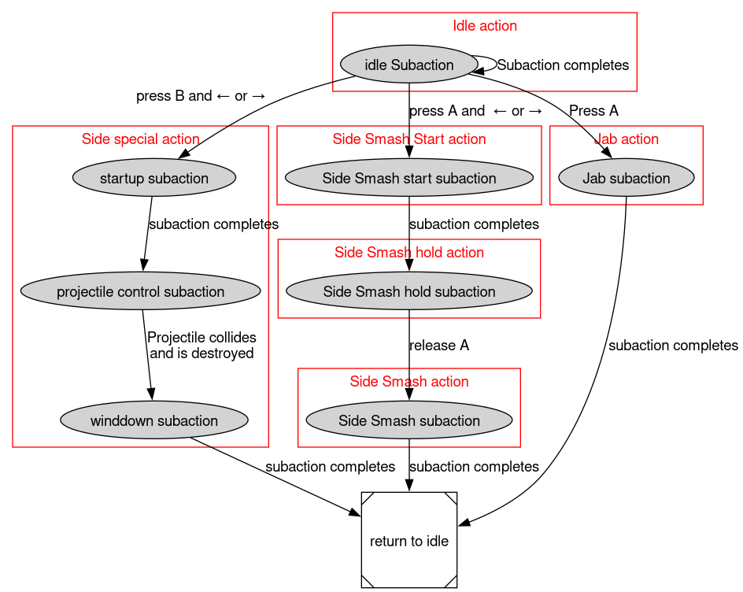
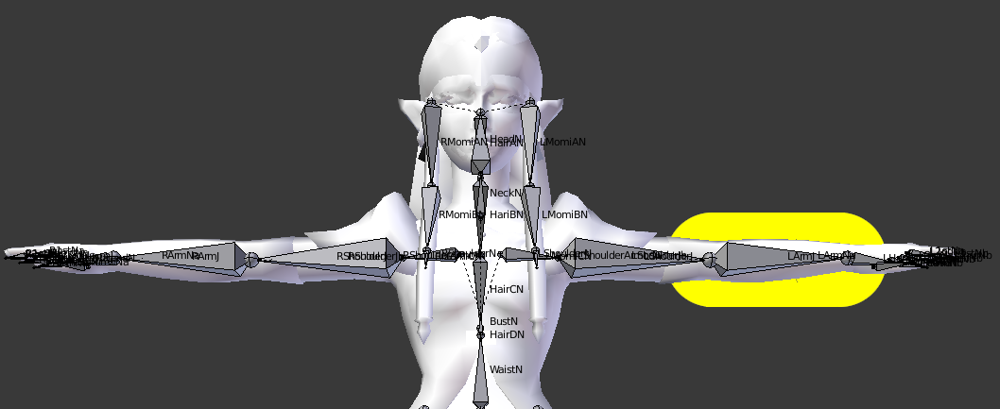
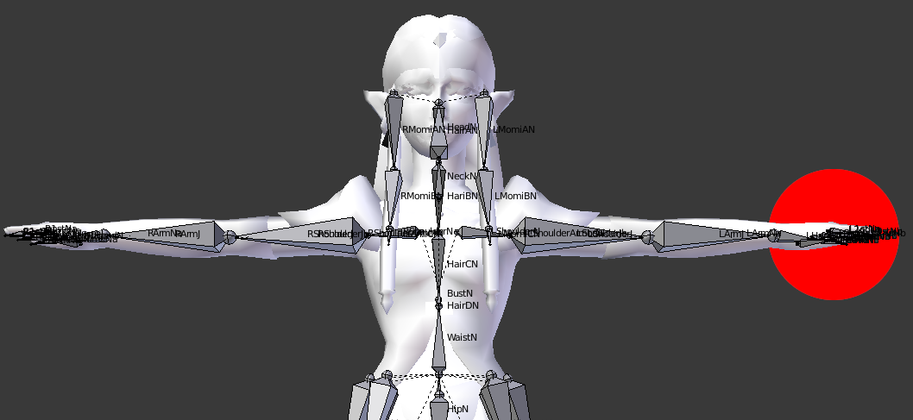

# Extracting framedata from Super Smash Bros Brawl.

## Introduction

rukaidata is a website that displays framedata on the characters in Super Smash Bros Brawl and its various mods such as Project M.
Previously framedata was manually compiled in large forum posts. e.g. https://smashboards.com/threads/squirtle-hitboxes-and-frame-data-3-6.395456/
However with a new version of Project M (P+) in the works, I wanted to automate this process.
In this article I'm going to run through technical details of how brawl works to explain how I did this.
I will assume you are familiar with programming, basic game dev concepts and basic understanding of the game itself.
This is not an exhasutive document, the aim is to give a high level overview while giving enough technical details so that a reader  can investigate further in a specific area.

With a modded Wii you can rip your brawl disk to an ISO file.
Then using a tool like [dolphin](https://dolphin-emu.org/) you can extract the files from the ISO to your own filesystem.


And this is where rukaidata starts.
It reads the file containing the [hitbox](https://en.wiktionary.org/wiki/hitbox) and [hurtbox](https://en.wiktionary.org/wiki/hurtbox) data it wants and then produces html tables + a 3D model.
Presumably there would be a data structure that defines what hitboxes and hurtboxes occur on each frame.
Something like this?
```json
{
    "frames": [
        {
            "hitboxes": []
        },
        {
            "hitboxes": []
        },
        {
            "hitboxes": [
                {
                    "x": 15.4,
                    "y": 15.4,
                    "radius": 1.0
                    "damage": 5,
                }
            ]
        },
        {
            "hitboxes": [
                {
                    "x": 15.4,
                    "y": 15.4,
                    "radius": 1.0
                    "damage": 5,
                },
                {
                    "x": 180.0,
                    "y": 15.4,
                    "radius": 1.0
                    "damage": 10,
                }
            ]
        }
    ]
}
```

This would define 1 hitbox on the 3rd frame and 2 on the 4th frame of the characters move.
While I think this is a good idea, and wrote a [game](https://canoncollision.com/) / [engine](https://github.com/rukai/PF_Sandbox) around this approach, the developers of brawl instead chose to have hitboxes and hurtboxes derived from the animation of the characters 3D models at runtime.

Brawl's approach has the advantage that:
*   Its quicker to define a characters moves and hitbox definitions will track animations if they are tweaked.
*   Hitbox placement is robust to dynamic changes in the game e.g. a character moves faster or increases in size due to an in game mechanic.

However, for rukaidata, this turns a simple excercise in parsing and drawing some circles in webgl into a hugely complex endeavor involving the parsing of character models, animations and scripts.
The rest of this article will walk through all of this.

## Brawl character files

Each Brawl character has many files, but there are 3 main types.
For Zelda these are:

*   FitZelda.pac - Contains constants and scripts for the characters actions.
*   FitZelda00.pac - Contains the 3D models for the 1st costume
*   FitZelda01.pac - Contains the 3D models for the 2nd costume ... and so on ...
*   FitZeldaMotionEtc - Contains the animations for all of the characters actions.

Brawl characters have a number of actions which are further split into subactions.
There is generally one subaction per action, with a few exceptions such as for special moves.
Most of the games logic is defined at the subaction level, actions are mostly glue between subactions.



The names used here for actions/subactions are their common names, not the actual internal names which are given names like "wait1", "attack11", or "attackS4".
Moves you might expect to be a single action such as smash attacks are actually multiple actions.

### The costume file (FitZelda00.pac)

The main components of a brawl 3d model (known as MDL0) are:
*   Vertices - A list of (x, y, z) points in 3D space defining the surface of the model.
*   Textures - A 2D image that gets wrapped onto the surface of the model.
*   UV's - Defines how the textures should be wrapped onto the vertices
*   Shaders - Code that gets run on the GPU. It specifies how to turn the data it receives into an image to display on screen.
*   Bones - A list of bones that can be moved by the animation.
*   Weights - Associates vertices with specific bones. e.g. The vertices making up the characters head should be moved when the characters head bone moves.
*   Objects - The vertices are assigned to various objects. Objects can have their visibility individually toggled at runtime. e.g. The sword in marth's hand can be turned on and off.

The bones are the only part of the model needed for framedata.
Bones form a tree, with each bone specifying its:
*   Name
*   Default [transformation matrix](https://en.wikipedia.org/wiki/Transformation_matrix) (forming a tpose)
*   List of children bones

Here you can see zelda's model with the bones displayed.
Every vertex on her model is controlled by one or more of these bones.


Each costume file duplicates all of this data, even for data like bones where they are supposed to be the same for each costume.

Relevant source code: MDL0 parser: https://github.com/rukai/brawllib_rs/tree/master/src/mdl0

### The animation file (FitZeldaMotionEtc.pac)

Contains the animations (known as CHR0) for every subaction.

Each animation consists of:
*   The number of frames the animation lasts for
*   A list of per bone animations known as CHR0Child

Each CHR0Child consists of:
*   The name of the bone this CHR0Child is specifying the animation for.
*   A list of [keyframes](https://en.wikipedia.org/wiki/Key_frame) in one of 6 formats.

No matter which format is used each keyframe can be processed into:
*   The frame the keyframe specifies 
*   A 4x4 transformation matrix that should be applied to the CHR0Child's bone on that frame.

To display an animation, we do the following steps:
1.  Start with the tree of Bones from the selected costume in its original tpose state.
2.  Then we traverse the bone tree, for each bone we lookup its CHR0child.
3.  If we find a CHR0Child then we:
    1.  Find the CHR0Child's keyframe corresponding to the current frame of the animation.
    2.  If there is no matching keyframe then we interpolate between the previous and next keyframe.
    3.  Set that bones matrix to the multiplication of its parent bones matrix and matrix generated from the keyframe.
4.  Otherwise we set that bones matrix to the multiplication of its parent bone and its original tpose matrix.
5.  Finally when the GPU renders vertices, it applies each bones final transformation matrix to any vertices that have weights on that bone.

Here there is just a CHR0Child with a single keyframe.
It is setting the rotation on her left forearm bone, named LArmJ.
All the children bones (her left hand bones) are also moved even though there are no keyframes modifying them.


Relevant source code:
*   CHR0 parser: https://github.com/rukai/brawllib_rs/blob/master/src/chr0.rs
*   Applying CHR0 to the bones: https://github.com/rukai/brawllib_rs/blob/27b7aca33ca111635863d7c41eb83c7e2db04f7d/src/high_level_fighter.rs#L413

### The constants and scripts file (FitZelda.pac)

The game logic for each character is split between:
*   C++ of which we can only see the compiled PowerPC machine code. - This is very difficult to modify and understand.
*   Brawls custom binary format scripting language. - This is comparatively easy to modify and understand.

#### Hurtboxes

Zelda's list of hurtboxes are defined in a hurtboxes section in the FitZelda.pac file.
Brawl's C++ engine reads from each characters version of this file when determining collisions.

Hurtboxes are spheres that are optionally stretched into spherical cylinders.
Each hurtbox is defined with these properties:
*   Bone index - The bone the hurtbox is attached to.
*   Offset - Offsets the hurtboxes position from the bone its attached to.
*   Stretch - An offset to stretch the sphere into a cylinder with hemispherical ends. A value of [0, 0, 0] results in a perfect sphere with no stretching.
*   Radius - The radius of the sphere.

"Attaching" the hurtbox to a bone means we apply the bones transformation matrix resulting from the current animation + frame to the hurtbox.

As an example say that zelda's hurtbox definitions included a hurtbox attached to zelda's left forearm bone, with enough stretch to cover her forearm, then it would be active in the area drawn yellow:


This single list of hurtboxes are the same for all actions but some actions will turn on/off specific hurtboxes.
For example sonic will disable all body hurtboxes and enable the spin hurtbox when using spin attacks.

Relevant source code: fighter data parser: https://github.com/rukai/brawllib_rs/blob/master/src/sakurai/fighter_data/mod.rs

#### Hitboxes

Brawls custom scripting language is often referred to as PSA, named after an early tool created to modify it, "Project Smash Attacks".
Each action runs two scripts: 
*   Entry - run when the action starts
*   Exit - run when the action ends

Each subaction has 4 different scripts that are all run when the subaction starts:
*   Main
*   GFX
*   SFX
*   Other

Each script is a list of events.
Each event consists of:
*   An event ID
*   A list of arguments

The ID determines what the event does.
Some of the available event IDs include:
*   Various control flow (if/else/switch/while/subroutine)
*   Pause the script for N frames
*   Pause the script until the Nth frame of the subaction is reached
*   Modify the characters frame speed multiplier (how many logical frames occur in one real frame)
*   Modify character velocity
*   Make the character invincible
*   Generate/delete/move hitboxes

Unlike hurtboxes, hitboxes are created by the special hitbox creation events in the character scripts.
But like hurtboxes they are also attached to bones + an offset from the bone.

To get hitbox data and other data only available by scripts I have a script runner that runs these scripts.
It needs to handle at least all of the control flow events and any event I want to include in the final website.
Loops are particularly troublesome to emulate as they can cause infinite loops due to relying on an external change that I cannot emulate.
To workaround this I implemented infinite loop detection which will just end the loop early.

Here is a brawl script, as exported by rukaidata.
It waits 3 frames, creates 4 hitboxes, waits another 4 frames, then removes the hitboxes.
This causes the character to have hitboxes active on frames 4-7 of this move.
```
AsyncWait(3.0)
CreateHitBox(HitBoxArguments { bone_index: 65, hitbox_id: 0, set_id: 0, damage: Constant(10.0), trajectory: 361, wdsk: 0, kbg: 70, shield_damage: 0, bkb: 30, size: 3.91, x_offset: 0.0, y_offset: 0.0, z_offset: 1.5, tripping_rate: 0.0, hitlag_mult: 1.0, sdi_mult: 1.0, effect: Slash, unk1: false, sound_level: 1, unk2: false, sound: Slash, unk3: 0, ground: true, aerial: true, unk4: 0, sse_type: Sword, clang: true, unk5: true, direct: true, unk6: 0 })
CreateHitBox(HitBoxArguments { bone_index: 61, hitbox_id: 1, set_id: 0, damage: Constant(9.0), trajectory: 361, wdsk: 0, kbg: 70, shield_damage: 0, bkb: 20, size: 3.91, x_offset: 0.0, y_offset: 0.0, z_offset: 0.0, tripping_rate: 0.0, hitlag_mult: 1.0, sdi_mult: 1.0, effect: Slash, unk1: false, sound_level: 1, unk2: false, sound: Slash, unk3: 0, ground: true, aerial: true, unk4: 0, sse_type: Sword, clang: true, unk5: true, direct: true, unk6: 0 })
CreateHitBox(HitBoxArguments { bone_index: 34, hitbox_id: 2, set_id: 0, damage: Constant(9.0), trajectory: 361, wdsk: 0, kbg: 70, shield_damage: 0, bkb: 20, size: 3.91, x_offset: 0.0, y_offset: 0.0, z_offset: 0.0, tripping_rate: 0.0, hitlag_mult: 1.0, sdi_mult: 1.0, effect: Slash, unk1: false, sound_level: 1, unk2: false, sound: Slash, unk3: 0, ground: true, aerial: true, unk4: 0, sse_type: Sword, clang: true, unk5: true, direct: true, unk6: 0 })
CreateHitBox(HitBoxArguments { bone_index: 65, hitbox_id: 3, set_id: 0, damage: Constant(13.0), trajectory: 67, wdsk: 0, kbg: 70, shield_damage: 0, bkb: 42, size: 3.91, x_offset: 0.0, y_offset: 0.0, z_offset: 6.89, tripping_rate: 0.0, hitlag_mult: 1.0, sdi_mult: 1.0, effect: Slash, unk1: false, sound_level: 2, unk2: false, sound: Slash, unk3: 0, ground: true, aerial: true, unk4: 0, sse_type: Sword, clang: true, unk5: true, direct: true, unk6: 0 })
SyncWait(4.0)
DeleteAllHitBoxes
```

As an example say a script attached a hitbox to zelda's left handbone then it would be active in the area circled red:


Relevant source code:
*   script parser: https://github.com/rukai/brawllib_rs/blob/master/src/script_ast/mod.rs
*   script runner: https://github.com/rukai/brawllib_rs/blob/master/src/script_runner.rs

### WiiRD codes

WiiRD codes (aka Gecko codes) are used to write cheat codes for the Wii, in the same style as an action replay.
It is developed in a text file, with each code given its own heading like this:
```
Tripping Rate is 0 V2 [ds22, KirbyIsCool]
* 0489E910 FFE0F090

Controller Input Lag Fix [Magus]
* C202AD8C 00000002
* 7C630214 3863FBFC
* 60000000 00000000
```
From this text file a binary file is generated that sequentially includes the bytes of each code, ignoring the headings and formatting.
These compact codes are really powerful and can do things like:
*   read and write from Wii memory
*   control flow such as if/else/while 
*   run or inject raw PPC bytecode.
There are a lot of [resources](https://geckocodes.org/index.php?arsenal=1) online that explain in detail how these codes work 

Brawl mods use WiiRD codes to rewrite or override the functionality of Brawls C++ code at runtime.
For most of these modifications via WiiRD, I have no hope of handling in rukaidata.
However there are two large usages of WiiRD that I CAN handle.

#### Script Injection

There is a brawl file called Fighter.pac that contains scripts common to all characters.
For some reason modders cannot get brawl to load their own version of this file so they have to use WiiRD codes to overwrite the loaded scripts in memory, this is commonly called PSA Injection.

In order to handle changes to Fighter.pac, I run the WiiRD codes with emulated Wii RAM.
Any writes to the memory range containing the Fighter.pac on the Wii, get rerouted to a copy of Fighter.pac.

Because Brawl scripts can call subroutines anywhere in Wii memory I also need to provide the entire WiiRD memory to the script parser.

This is one of those wonderful times where things work far better than they have any right to.

Relevant source code:
*   Wii memory emulation: https://github.com/rukai/brawllib_rs/blob/master/src/wii_memory.rs
*   wiiRD runner: https://github.com/rukai/brawllib_rs/blob/master/src/wiird_runner.rs

#### Animation Engine

There is a WiiRD code in Project M and its derivative mods called "Animation Engine".
It contains a large table specifying a new frame speed multiplier (FSM) for subactions and actions of characters.
This has a huge effect on the framedata of a move.
An FSM of 2, would move a hitbox normally occurring on frame 5 to occur on frame 10!
In order to get this crucial data I read the contents of WiiRD emulated Wii memory at the offset this table is stored at.
I then parse the data and make it available to the script runner.

This is easily the hackiest, most hardcoded thing in rukaidata but IMO the extra accuracy it provides is worth the hack.

## Putting it all together

The process I use to display the hurtboxes and hitboxes for a brawl mod looks like this:
1.  Run the WiiRD codeset, modifying Fighter.pac and keeping the WiiRD Wii Memory.
2.  Retrieve the animation engine FSMs from the WiiRD Wii memory
3.  Parse the animations from FitZeldaMotionEtc.pac, the bones from FitZelda00.pac and the hurtboxes and the scripts from FitZelda.pac and Fighter.pac.
4.  Iterate over every frame, of every subaction, of every character.
    1.  Apply the animation of the current subaction and frame to the bones.
    2.  Run the subaction scripts for this frame.
        *   This needs to maintain state such as: hurtbox vulnerability, hitboxes, character movement and variables.
        *   It also needs to handle control flow of if/else statements and loops.
    3.  Apply any relevant animation engine FSMs
    4.  Take all the data that will need to be accessed in the webpage for rendering and store it in high level structs.
5.  Generate a .html file for each subaction, serializing all the high level data structures to bincode in a seperate file.
6.  The .html pages initialize a renderer written in rust with wgpu compiled to wasm that displays the bincode encoded data.

The resulting render:


I believe the most important factor leading to rukaidata's success is my insistence on automating everything and keeping everything reproducible.
I have built a consistent pipeline that reads in raw brawl files + raw brawl mod files and produces static html/bincode/wasm files.
As well as keeping things sane for my own development, it means Brawl modders can run rukaidata locally to rapidly test their changes.

## Prior work

When modders want to modify character files they use a tool called Brawlcrate for model/animation files or PSAC for scripts files.
95% of the reverse engineering of these files was already done for me in open source projects such as Brawlcrate.
I just had to port it to rust, improving the architecture along the way.
However I did have to dig through C# reflection hell to figure it all out...

## gif rendering

When users link a page of the website in discord I need to include a gif in the embedded preview.
Since the web renderer is written in wgpu, the renderer can also be run natively over vulkan/metal/dx12.
Making use of this I also run the renderer at website generation time and store the output in gif files.
One gif file is created per subaction page allowing the preview gif to be served statically along with the webpage.

## Cool things I'll probably never get around to

Currently rukaidata mostly ignores actions, instead it handles everything at the subaction level.
It would be really nice to handle everything at the action level instead.
To make this work properly though, I would have to have some system for running the same action with different variables.
This could occur with hardcoded values used at page generation time, or I would have to move the script runner into the browser and allow users to specify their own variables.

Currently rukaidata displays hitboxes, hurtboxes, ledge grab boxes and environment collision boxes.
It would be really cool to render the character along with these visualisations.
It would give the user an in-game grounding to what the data is showing.

## Reflections on the overall approach

If I were to start this project over from scratch I would take a completely different approach.
To be truly accurate I should have extracted data from a live running game.
There are a fair few actions that cannot be extracted because of the limitations in this approach to emulating brawl.
This logic could probably either be done at the emulation level (within dolphin) or within Brawl itself.

One big downside to this approach is I would need to manually define the inputs to reach each move.
For a large portion of each characters moves I could just have a common set of inputs that would work across all characters.
But there are still a lot of character specific moves that would need to be uniquely specified.

However, I have no desire to rewrite rukaidata to do this, the current approach is good enough.
